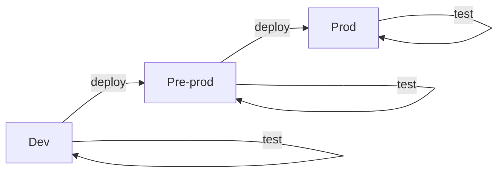

# Deploy Environments

## DevOps Cycle

* Deploy what?
  * microservice
  * product
  * (environment)

## Continuous Delivery / Deployment

* environments
  * dev
  * pre-prod
  * prod

* workflow
  * deploy
  * quality gates (tests)
    * intra service
    * inter service
  * repeat

## Infrastructure as Code

* snowflake environments
* describe assets (bill of material)
* how to assemble environments
* domain specific language
* unambiguous interpretation

## Terraform 

* immutable
* declarative
* syntax
* state
* delta
* plan
* apply
* destroy

## IaC next level

* IaC under version control
  * code and config
  * review
  * test / plan
  * IaC is a product on its own 
  
* Continuous
  * test
  * integrate
  * deploy

* layered environments (modularity)

* separate config from code
  
## Environment branches

## Challenges

* 3 layer
  * config code separation
  * moduls

* rainbow deploy
  * 0 downtime deploy
  * 0 downtime IaC deploy

## Proof of Concept

### Terraform

* create a VPC
* scaffolding: create 2x2 subnets in 2 AZ; one public 1 private
* create 1 EC2 in each subnet
  * IGW, LB to instances in public subnet
  * no internet access for backend instances 
* EC2 bootstrap (and problems)

### Ansible

* govern EC2

?
